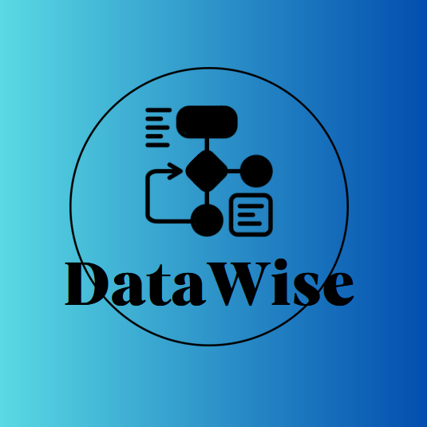
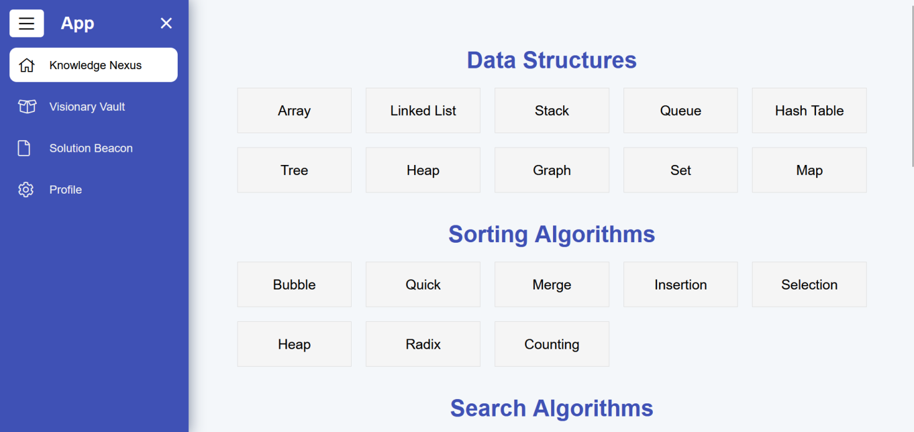

# DataWise 🚀

DataWise is an innovative application designed to prepare candidates for technical interviews by mastering data structures and algorithms. The platform leverages a custom-built AI model—developed entirely in Python without external AI libraries—to automatically categorize coding tasks. DataWise integrates modern technologies such as Angular for the frontend, Flask for the AI module, and ASP.NET for the API, ensuring scalability and reliability.



---

## Table of Contents 📑

- [Project Overview](#project-overview)
- [Architecture](#architecture)
- [Prerequisites](#prerequisites)
- [Installation & Setup](#installation--setup)
- [Running the Project](#running-the-project)
- [Screenshots](#screenshots)
- [License](#license)
- [Contact](#contact)

---

## Project Overview 🌟

DataWise is designed for candidates and professionals preparing for technical interviews at top tech companies (e.g., FANG). It offers:

- **Learning Resources:** Lectures and interactive visualizations on data structures and algorithms.
- **AI-Powered Categorization:** Automatic classification of coding tasks using a custom convolutional neural network (TextCNN).
- **Modular Design:** Separate components for AI, API, and the user interface for enhanced maintainability and scalability.

---

## Architecture 🏗️

The project is organized into several key components:

- **DataWise.AI (Python):**  
  Contains the AI module with a custom TextCNN model for text classification. It uses Flask to expose API endpoints for processing requests.  
  **Live AI Module:** [https://ai.datawise.techlab.cloud/](https://ai.datawise.techlab.cloud/)

- **DataWise.Api (.NET):**  
  Serves as the central API layer, handling business logic and communication between the frontend and AI module using ASP.NET.  
  **Live API:** [https://api.datawise.techlab.cloud/](https://api.datawise.techlab.cloud/)

- **DataWise.Client (Angular):**  
  Provides a modern, interactive user interface built with Angular and TypeScript, connecting to the API via RESTful endpoints.  
  **Live Application:** [https://datawise.techlab.cloud/](https://datawise.techlab.cloud/)

- **DataWise.Core, DataWise.Data, DataWise.Tests:**  
  Additional layers handling core services, data management, and automated testing respectively.

---

## Prerequisites 📋

Before running the project, ensure you have the following installed on your machine:

- **Python 3.x** (for DataWise.AI)  
  Required packages: Flask (and any additional dependencies as specified in `requirements.txt`).

- **.NET SDK** (for DataWise.Api)  
  A compatible version should be installed (e.g., .NET 5/6).

- **Node.js and npm** (for DataWise.Client)  
  Ensure you have the latest stable versions installed.

---

## Installation & Setup 🛠️

1. **Clone the repository:**

  ```bash
  git clone https://github.com/alex-stefanov/DataWise.git
  cd DataWise
  ```
   
2. **Set up the Python AI Module:**
   
  ```bash
  cd DataWise.AI
  python -m venv venv
  source venv/bin/activate   # On Windows use: venv\Scripts\activate
  pip install -r requirements.txt
  ```

3. **Set up the .NET API:**
   
  ```bash
  cd ../DataWise.Api
  dotnet restore
  ```

4. **Set up the Angular Client:**
   
  ```bash
  cd ../DataWise.Client
  npm install
  ```

## Running the Project ▶️

1. **Start the AI Module:**
   
  ```bash
  cd DataWise.AI
  python app.py
  python train.py
  ```

2. **Start the .NET API:**
   
  ```bash
  cd DataWise.Api
  dotnet run
  ```

3. **Start the Angular Client:**
   
  ```bash
  cd DataWise.Client
  npm start
  ```

## Screenshots 📸

### DataWise Main Interface  


### Application Logo  


---

## License 📄

This project is licensed under the [MIT License](LICENSE).

---

## Contact 📬

For any questions or issues, please reach out to:

**Alex Ivailov Stefanov**  
📧 Email: [rlgalexbgto@gmail.com](mailto:rlgalexbgto@gmail.com)

**Project Supervisor: Zdravka Stefanova Dimitrova**  
📧 Email: [dimitrova@pmgkk.com](mailto:dimitrova@pmgkk.com)

